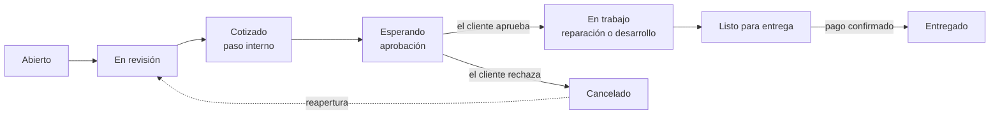

# UniTech Desk

Sistema web de **tickets de soporte** para solicitudes de **reparación de hardware** y **desarrollo de software**, pensado para estudiantes y clientes externos de la universidad. El cliente registra su solicitud, recibe una cotización, la aprueba, paga y da seguimiento hasta la entrega; el personal gestiona todo el ciclo desde un panel interno.

- **Aplicación en línea:** `https://<dirección-de-la-aplicación>` *(completar al publicar)*
- **Panel del personal:** `https://<dirección-de-la-aplicación>/#/admin` (las credenciales de revisión se entregan por separado)
- **Autor:** Brian Balladares · Universidad Nacional de Ingeniería (UNI)
- **Curso:** `[nombre del curso]` · **Docente:** `[nombre del docente]`

---

## Contenido

1. [Qué problema resuelve](#1-qué-problema-resuelve)
2. [Funcionalidades](#2-funcionalidades)
3. [Flujo de un ticket](#3-flujo-de-un-ticket)
4. [Arquitectura y tecnologías](#4-arquitectura-y-tecnologías)
5. [Estructura del repositorio](#5-estructura-del-repositorio)
6. [Base de datos](#6-base-de-datos)
7. [Seguridad](#7-seguridad)
8. [Pruebas](#8-pruebas)
9. [Despliegue](#9-despliegue)
10. [Alcance y limitaciones](#10-alcance-y-limitaciones)

---

## 1. Qué problema resuelve

Las solicitudes de reparación y de desarrollo suelen llegar por mensajes sueltos, sin un código, sin un estado visible y sin un registro de lo que se acordó o se cobró. UniTech Desk ordena ese proceso:

- cada solicitud tiene un **código único** (`UTD-1001`, `UTD-1002`…) y un **estado** que el cliente puede consultar;
- la **cotización** se publica y el cliente la aprueba o la rechaza antes de que empiece el trabajo;
- el **pago** queda registrado (referencia y comprobante) y el equipo no se entrega sin él;
- cada cambio queda en un **historial** y el cliente recibe **correos automáticos**.

## 2. Funcionalidades

**Para el cliente (sin cuenta, solo con su código y su correo)**

- Crear una solicitud de hardware o de software, con fotos o PDF de apoyo.
- Consultar el estado del ticket con el código y el correo con el que lo creó.
- Aprobar o rechazar la cotización.
- Enviar la referencia de pago y un comprobante.
- Recibir correos en cada paso importante (solicitud recibida, cotización lista, pago confirmado, entrega…).

**Para el personal (inicio de sesión)**

- Panel con la lista de tickets, filtros, paginación y estadísticas.
- Cambio de estado según las transiciones permitidas, con motivo cuando es obligatorio.
- Cotización con monto (un monto de cero significa sin costo) y registro de la decisión del cliente por teléfono.
- Gestión del pago, asignación de responsable y notas internas que el cliente nunca ve.
- Exportación a CSV.
- Roles: `ADMIN`, `TECNICO` y `DESARROLLADOR`.

## 3. Flujo de un ticket



Reglas principales:

1. Crear un ticket **no cuesta nada**; el pago llega después de aprobar la cotización.
2. La cotización se prepara en un paso interno y solo se **publica** al pasar a «Esperando aprobación».
3. El trabajo **no puede iniciar** sin una cotización aprobada.
4. Un ticket con monto **no se entrega** sin el pago confirmado.
5. Un ticket cancelado puede reabrirse (si no está pagado); la cotización anterior se descarta.

Estas reglas se aplican en **dos niveles**: en los servicios de la aplicación y en triggers de la base de datos, de modo que no se pueden saltar ni llamando a la API directamente.

## 4. Arquitectura y tecnologías

```
Navegador (HTML + JavaScript)
        │  HTTPS · JSON
        ▼
UniTechDesk.Api       endpoints HTTP, autenticación, seguridad, correos
        │
UniTechDesk.Core      reglas del negocio y servicios (no conoce SQL ni HTTP)
        │
UniTechDesk.Data      acceso a SQL Server con consultas explícitas
        │
SQL Server            base de datos UniTechDesk
```

| Capa | Tecnología |
|---|---|
| Backend | .NET 10, ASP.NET Core (API mínima) |
| Acceso a datos | ADO.NET con `Microsoft.Data.SqlClient` y SQL parametrizado (sin ORM) |
| Base de datos | SQL Server (24 tablas, vistas, triggers, índices y roles) |
| Autenticación del personal | JWT firmado (HS256) y contraseñas con BCrypt |
| Correos | SendGrid (API REST) con bandeja de salida y reintentos |
| Frontend | JavaScript sin frameworks, servido por la propia API |
| Pruebas | xUnit, más una verificación estática del SQL contra los scripts de la base |

Decisiones de diseño que vale la pena destacar:

- **Capas independientes.** `Core` no depende de SQL ni de HTTP, por lo que las reglas se prueban sin base de datos.
- **Una transacción por operación.** Cada cambio de estado, cotización o pago se guarda de forma atómica, junto con su historial y el correo pendiente.
- **Control de concurrencia.** Si dos personas editan el mismo ticket, la segunda recibe un aviso de conflicto en lugar de pisar el cambio de la primera (`ROWVERSION`).
- **Bandeja de salida (outbox).** Los correos se guardan en la base dentro de la misma transacción y se envían en segundo plano con reintentos. Si SendGrid falla, el ticket se guarda igual y el correo sale después.
- **Un solo origen.** La API sirve también el frontend, así que no hace falta configurar CORS.

## 5. Estructura del repositorio

```
UniTechDesk.sln
database/                       Scripts SQL (00 a 07), se ejecutan en orden
src/
  UniTechDesk.Api/              Servidor web, endpoints, seguridad, SendGrid
    wwwroot/                    Frontend (HTML, JS, CSS)
  UniTechDesk.Core/             Reglas del negocio, servicios, plantillas de correo
  UniTechDesk.Data/             Acceso a SQL Server
tests/
  UniTechDesk.Tests/            Pruebas automatizadas
  UniTechDesk.TestSupport/      Base de datos en memoria para pruebas
tools/
  generar_workflow.js           Genera el catálogo de estados y transiciones
  verificar_sql.py              Verificación estática del SQL contra los scripts
```

## 6. Base de datos

La base `UniTechDesk` tiene **24 tablas**, entre ellas tickets, cotizaciones, pagos, adjuntos, personal, catálogos (carreras, recintos, tipos de equipo, estados y transiciones), notas, historial y la bandeja de correos.

Parte de las reglas del negocio vive en la propia base:

- **Triggers** que impiden iniciar el trabajo sin cotización aprobada y entregar sin pago.
- **Restricciones** (`CHECK`, claves foráneas, índices únicos) para los códigos de estado, los tipos de archivo permitidos y la integridad de los datos.
- **Rol de mínimos permisos** (`rol_unitech_api`): la aplicación se conecta con un usuario que solo puede leer y escribir lo que necesita. No puede borrar el historial ni usar `sa`.

Scripts, en este orden: `00_crear_base` → `01_tablas` → `02_indices_y_reglas` → `03_catalogos` → `04_vistas` → `05_seguridad`. Los scripts `06_datos_demo` (cuentas y tickets de ejemplo) y `07_pruebas` (comprobaciones de las reglas) son solo para desarrollo.

## 7. Seguridad

- **Contraseñas** con BCrypt (factor 12). Bloqueo temporal tras 5 intentos fallidos. El inicio de sesión responde igual si el usuario no existe o la contraseña falla, para no revelar qué usuarios hay.
- **Límite de peticiones por IP** en el inicio de sesión, la creación de tickets y las consultas.
- **SQL siempre parametrizado**: ningún dato del usuario se concatena en una consulta.
- **Cabeceras de seguridad y CSP estricta** (sin scripts ni estilos en línea).
- **Archivos adjuntos** validados por su contenido real (no por la extensión): solo imágenes (JPG, PNG, GIF, WEBP) y PDF, hasta 5 archivos de 5 MB. Se guardan fuera de la carpeta pública con un nombre aleatorio y se descargan con enlaces firmados que vencen a los 10 minutos.
- **Secretos fuera del código**: la cadena de conexión, la clave JWT y la clave de SendGrid se configuran con `user-secrets` o variables de entorno, nunca en el repositorio.
- **Mínimos permisos en la base de datos** (ver sección anterior).
- La aplicación **se niega a arrancar** con configuraciones inseguras, por ejemplo si se conecta como `sa` o si falta la clave de firma de los tokens, y avisa de otros riesgos al iniciar.

## 8. Pruebas

```powershell
dotnet test
```

- **Más de 400 pruebas automatizadas** que cubren las reglas del negocio, los servicios, el flujo del cliente y del personal, los correos, la autenticación, la seguridad y el servidor HTTP completo.
- **Prueba de extremo a extremo en un navegador real** del flujo completo: crear un ticket con foto, consultarlo, cotizar, aprobar, pagar con comprobante y entregar.
- **Verificación estática del SQL** (`tools/verificar_sql.py`): contrasta cada sentencia que ejecuta el código con los scripts de la base (tablas, columnas, parámetros y valores de catálogo).

## 9. Despliegue

La aplicación se publica en **Microsoft Azure**: la API y el frontend en un **App Service** (.NET 10) y la base de datos en **Azure SQL Database**. En producción los secretos se configuran como variables de entorno del servicio, se activa HTTPS y los correos se envían con SendGrid.

*(Completar con la dirección pública y la fecha de publicación.)*

## 10. Alcance y limitaciones

Por decisión de alcance, esta versión **no incluye**: recuperación de contraseña, doble factor de autenticación ni administración del personal desde la web (las cuentas se crean en la base de datos). Todo el personal activo tiene los mismos permisos dentro del panel, sin distinción por rol.

El código del ticket es **secuencial**, así que la protección para consultar un ticket es el código **junto con** el correo del cliente, más un límite de consultas por IP. Una mejora natural sería dar a cada ticket un código de acceso aleatorio enviado por correo.

No se midieron los límites de carga ni el comportamiento bajo mucho tráfico.
